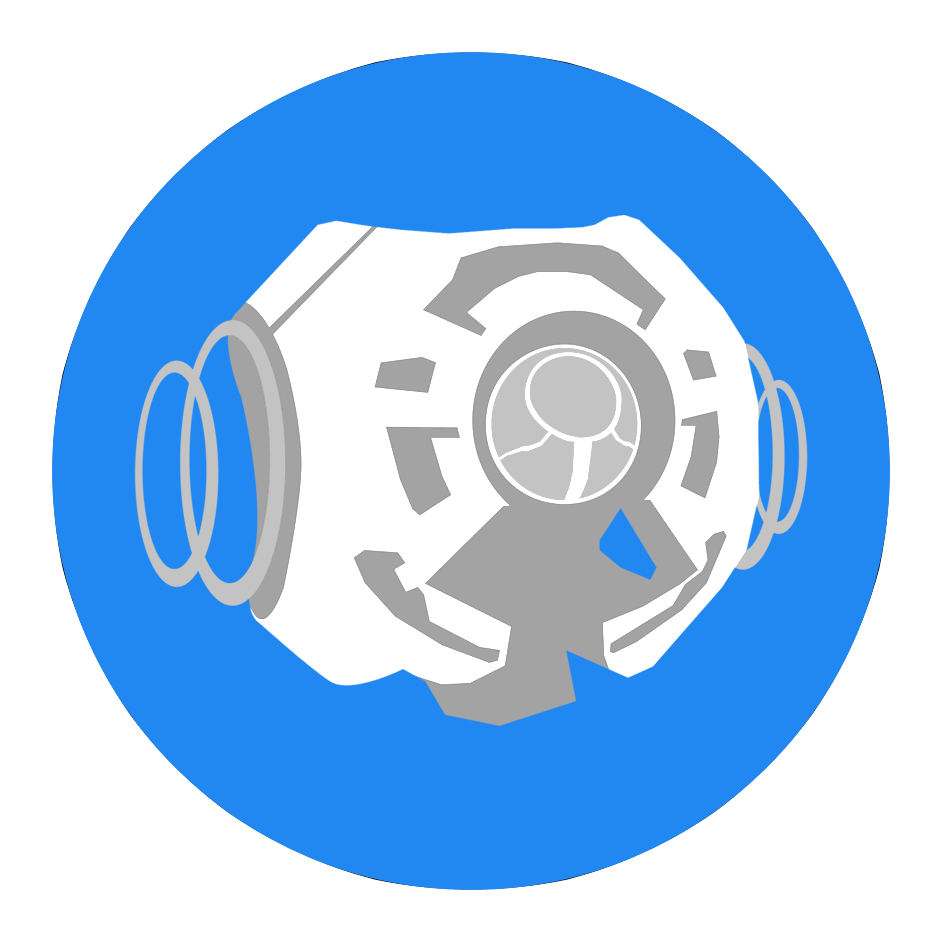

<html>
    <p align="center">
        
    </p>
    <h1 align="center">Forge CE</h1>
    <p align="center">
       Halo Custom Edition Forge system using Chimera and SAPP
    </p>
</html>

Forge CE is a project that adds a Forge-like system into Halo Custom Edition, mostly by replicating Sapien capabilities on runtime, by now Forge is only compatible with the [Forge Island](https://www.youtube.com/watch?v=K_QViDBnpq0) map project, there are plans to add compatibility with other maps like [Forge World](https://www.youtube.com/watch?v=kUDYwVF0OLk) in the future!

Forge is not magic.. it is the compilation of enthusiast modders and developers with a strong understanding of the Halo Custom Edition engine, that are aiming to provide projects with a professional build.

No, it is not compatible with Halo 1 on MCC yet... we need to create a port of Chimera Lua before thinking about a port for MCC, but a port is theoretically possible.

# Getting Forge
Get the latest version of the mod using the Mercury command:
```
mercury install forgeisland
```
And then you should be able to join any server you want.

# How it works?
This project was made with Chimera Lua scripting for the client side and SAPP Lua scripting for the server side, it has in built rcon communication system, allowing us to share data via rcon messages and intercept any message to execute client side or server side actions.

Forge implements [lua-blam](https://github.com/Sledmine/lua-blam) giving easy memory access and ensuring API compatibility with SAPP, keeping same code base for each platform, plus other libraries to give the most stable experience, avoiding random crashes as possible with unit testing and ensuring project maintainability.

This project is based in some type of REST architecture, meaning that data persistence is done via requests, keeping bandwith, flow and functionality along the entire development, every request is proccessed just once, only when needed, in a single rcon message with specific properties.

It reimplements some concepts from modern app libraries like the store from [redux-js](https://redux.js.org) using [lua-redux](https://github.com/piperswe/lua-redux), giving security, performance and operability to the project.

- Create, update and delete for any Forge object dynamically in online or local mode
- Maps file support, save and load Forge maps
- Spawn reflection system, Forge objects can reflect data to the netgame system to create player spawns, weapon spawns, vehicle spaws, flag spawns, etc
- Native multiple bipeds support

# Highlights
- Provides a store for all the Forge objects created on the server meaning the store is reusable, when a player joins mid game all the objects in the store can be pushed to the new player and sync everything created by other players on the server, also this process is an "asynchronous" process that can push tons of objects to different players without having to block the server main thread
- Any forged map is stored in a versionless .fmap meaning that forged maps will work in almost any Forge map version, objects that are not anymore in the Forge map will be ignored
- Forge works in local mode **(Playing the map via LAN mode option, this does not work in a real LAN game)**, the script will act as a server and client at the same time allowing you to play in the same way as if you were connected to a real server
- Rcon messages are not persistent, except data intercepted from them, meaning that messages are not sent too often, only when they are needed, ensuring performance and less spamming messages blocking Halo Custom Edition thread flow
- Rcon messages come with full range compression to send specific values like floats that are hard to send via string message, for example coordinates and rotation values for every object are too important to keep them exactly in the same way they were sent, the compression used in Forge ensures the maximum and the minimum exact value at the moment of decompression using `string.pack` and `string.unpack` from **Lua 5.3** (SAPP uses **Lua 5.1**, but some compatibility with **Lua 5.3** can be achived by implemeting a compatibility library, bringing `string.unpack` and `string.pack` as a backport)

# Help needed with
We are giving our best effort to make this project as complete and useful as possible, but there are a few things out of our knowledge where you can probably give us a hand to accelerate development.

- Object placement features, grid, magnetisim, etc.
- Object history placement, provide undo, redo operations along time.
- Better controls implementation, multi input devices is key, keyboard, mouse and joystick support are must have features.

# Documentation
Checkout some of the markdowns hosted on this repository about Forge in general:

- [Controls and commands](FORGE.md)
- [Changelog](CHANGELOG.md)

# Thanks and Credits
- Thanks Visual Studio Code, [EmmyLua](https://github.com/EmmyLua) and Sumneko for the [lua-language-server](https://github.com/sumneko/lua-language-server), providing a strong and fast workflow for Lua development
- bluebird75 for his awesome [luaunit](https://github.com/bluebird75/luaunit) testing framework
- Egor Skriptunoff for resolving the [old rotation function](https://stackoverflow.com/questions/30493826/yaw-pitch-and-roll-rotations-to-six-float-variables)
- [aLTis94](https://github.com/aLTis94) for inspiring and providing help, examples of different features implementation methods
- [JerryBrick](https://github.com/JerryBrick) for adding functionality to Chimera and keeping features updated
- Sledmine for leading the project, coding and reverse engineering, in special for the [lua-blam](https://github.com/Sledmine/lua-blam) module
- MrChromed for doing shaders, models, sounds, tag fixes, etc
- Solink for porting and optimizing models for Forge, such as the bsp and almost all the objects of the project

# Contribute to the project!
We need a lot of help to achieve this project, we have a workflow designed for contributions with support for people being added into the project development as soon as possible.
You can contribute with testing on our beta sessions or directly contributing with the map
content or code contributions.

Join us on our Discord server for more information: https://discord.shadowmods.net/
